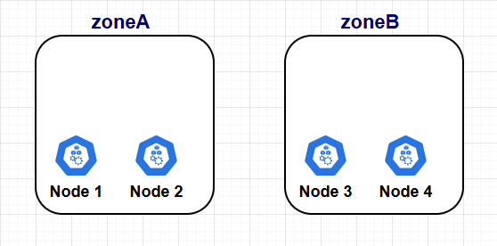
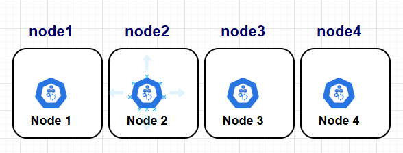
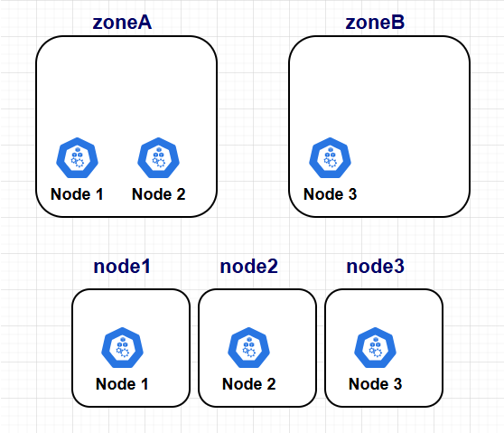

# Pod Topology Spread Constraints

### What are Topology Spread Constraints?

Topology Spread Constraints allow you to control how pods are distributed across your cluster.
By specifying constraints in a pod's spec, you can ensure that pods are evenly spread across topology domains, such as zones, nodes, or custom labels.

---

### Key Components
1. Topology Domains:

   - Defined using Kubernetes node labels (e.g., topology.kubernetes.io/zone or kubernetes.io/hostname).
   Represents the grouping of nodes based on attributes like zones, regions, or hostnames.

2. Spread Constraints:

   - Specify how pods should be distributed within or across these topology domains.

3. Matching Pods:

   - Only pods that match a specified label selector are counted when determining the distribution.

---

### Node labels
Topology spread constraints rely on node labels to identify the topology domain(s) that each node is in. For example, a node might have labels:

```text
topology.kubernetes.io/region: us-east-1
topology.kubernetes.io/zone: us-east-1a
```

---

### Fields in Topology Spread Constraints

1. <code>topologyKey</code>:

    - The node label key that defines the topology domain (e.g., topology.kubernetes.io/zone).

2. <code>whenUnsatisfiable</code>:

    - Determines how to handle unsatisfiable constraints:
        - DoNotSchedule: Prevent scheduling pods that violate constraints.
        - ScheduleAnyway: Allow scheduling but report the skew.

3. <code>maxSkew</code>:

    - Maximum allowable difference in the number of matching pods between topology domains.

4. <code>labelSelector</code>:

    - Specifies which pods to include when calculating skew.
---
### Example 

#### one topology spread constraint:
Imagine we have 4 nodes with two topology domains based on <code>topologyKey: "topology.kubernetes.io/zone"</code> node label.



```yaml
apiVersion: apps/v1
kind: Deployment
metadata:
  name: web-app
spec:
  replicas: 7
  selector:
    matchLabels:
      app: web
  template:
    metadata:
      labels:
        app: web
    spec:
      topologySpreadConstraints:
        - maxSkew: 1
          topologyKey: "topology.kubernetes.io/zone"
          whenUnsatisfiable: "DoNotSchedule"
          labelSelector:
            matchLabels:
              app: web
      containers:
        - name: nginx
          image: nginx
```
**Explanation**

- <code>labelSelector</code> field tells that this constraint is applied to pod with <code>app: web</code> label.
- <code>topologyKey: "topology.kubernetes.io/zone"</code> implies the even distribution will only be applied to nodes that are labeled topology.kubernetes.io/zone: <any value> (nodes that don't have a zone label are skipped).
- <code>whenUnsatisfiable: DoNotSchedule</code> tells the scheduler to let the incoming Pod stay pending if the scheduler can't find a way to satisfy the constraint.
- <code>maxSkew: 1</code> defines that the difference amount of this pod replicas between any two zones must not be more than one.

finally, to satisfy this constraint 3 replicas of pod will be deployed on one zone and 4 replicas on another one.
Here does not matter if all replicas in a zone deploy on a single node within that zone.
For example if 4 replicas go on zoneA (Node1 , Node2) all of them can deploy just on node1 or node2 or either distribute between them.

---
#### multi topology spread constraint:



```yaml
apiVersion: apps/v1
kind: Deployment
metadata:
  name: web-app
spec:
  replicas: 7
  selector:
    matchLabels:
      app: web
  template:
    metadata:
      labels:
        app: web
    spec:
      topologySpreadConstraints:
        - maxSkew: 1
          topologyKey: "topology.kubernetes.io/zone"
          whenUnsatisfiable: "DoNotSchedule"
          labelSelector:
            matchLabels:
              app: web
        - maxSkew: 1
          topologyKey: "kubernetes.io/hostname"
          whenUnsatisfiable: "DoNotSchedule"
          labelSelector:
            matchLabels:
              app: web
      containers:
        - name: nginx
          image: nginx

```

**Explanation:**

- Spreads pods evenly across both zones (topology.kubernetes.io/zone) and nodes (kubernetes.io/hostname).
- Ensures balanced distribution while maintaining strict constraints.
- Like the above example based on first constraint maxSkew and topologyKey, one zone will have 3 replicas and another zone 4 replicas.
- With second constraint opposite to first example a node in a zone can not have all replicas, each node based on total replicas and maxSkew value can have maximum 2 replica 

---

### conflicting topology spread constraints:



```yaml
apiVersion: apps/v1
kind: Deployment
metadata:
  name: web-app
spec:
  replicas: 6
  selector:
    matchLabels:
      app: web
  template:
    metadata:
      labels:
        app: web
    spec:
      topologySpreadConstraints:
        - maxSkew: 1
          topologyKey: "topology.kubernetes.io/zone"
          whenUnsatisfiable: "DoNotSchedule"
          labelSelector:
            matchLabels:
              app: web
        - maxSkew: 1
          topologyKey: "kubernetes.io/hostname"
          whenUnsatisfiable: "DoNotSchedule"
          labelSelector:
            matchLabels:
              app: web
      containers:
        - name: nginx
          image: nginx
```
- to satisfy the first constraint, 3 pods go on one zoneA and 3 pods go on zoneB.
- in terms of the second constraint, in zoneA: node1 can have 2 pods and node2 1 pod or vice versa.
but in ZoneB as there is only one node and as maxSkew is set to 1, if all 3 pods be deployed to node3 it will exceed Maximum allowable difference, just 2 pods can be deployed on node3 and 1 pod stay in <code>Pending</code> state.

**Solutions:**

To overcome this situation:

- you can either increase the value of maxSkew 
- or modify one of the constraints to use whenUnsatisfiable: ScheduleAnyway.

